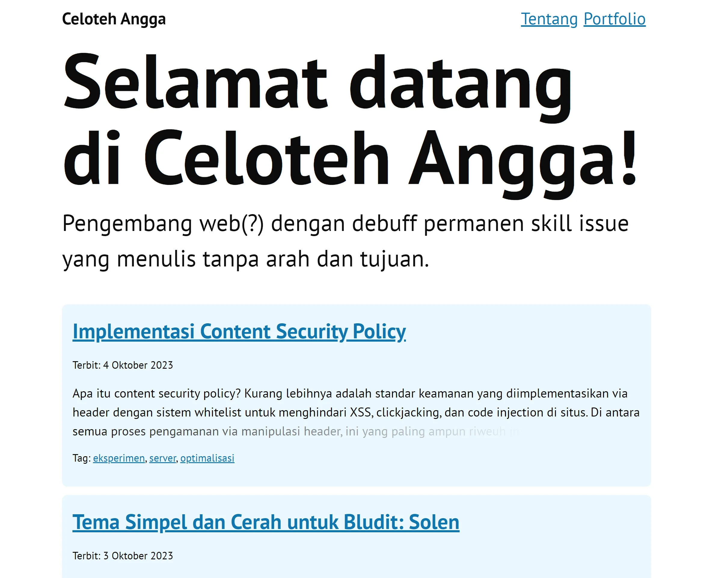
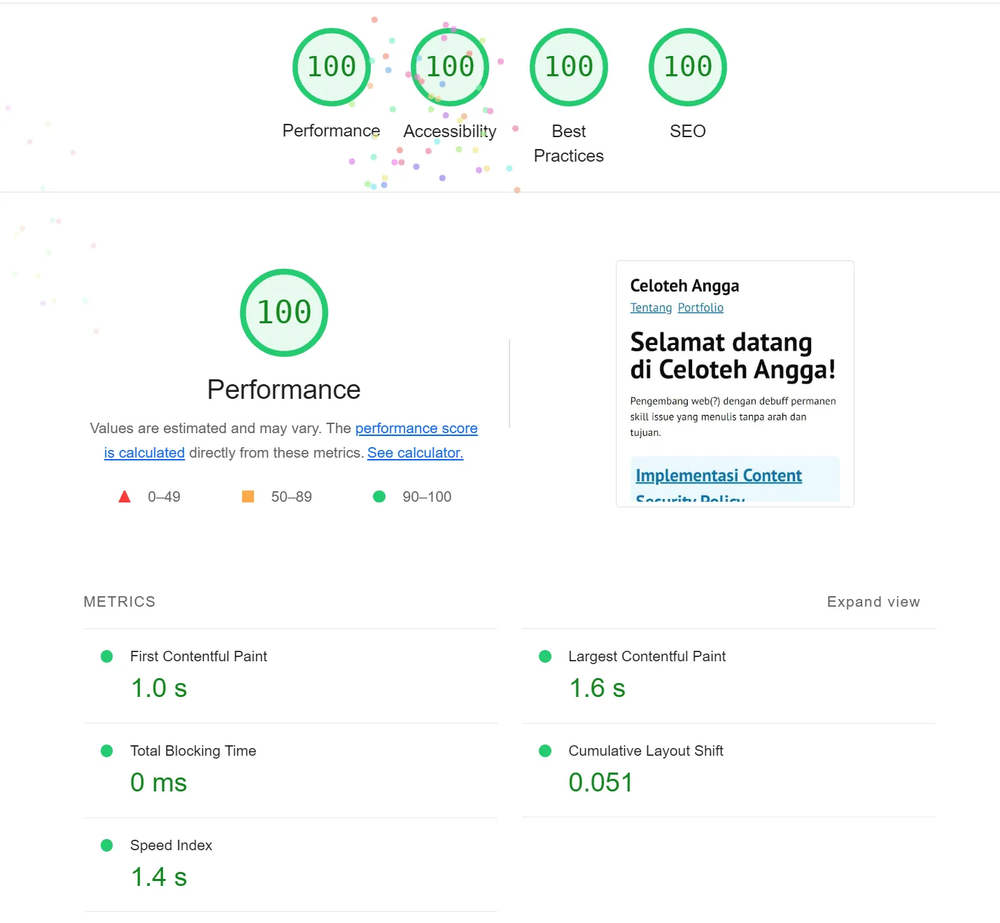

# Luana for Bludit Theme

A blogging theme focusing on text and maximizing usability for screen reader users made with a small CSS framework called Chota.

## Features

- Include PrismJS for syntax highlighting with a11y-light syntax highlighting theme by [Eric W. Bailey](https://github.com/ericwbailey/a11y-syntax-highlighting)
- Super light on browsers with only 36KB page weight which constitutes to 0.01g CO2e per new visit
- Text focus with big and bold text
- With simple content markup microdata using Schema.org vocabulary for every single blog posts
- Support for screen reader users
- Three languages support: Indonesian, English, and Japanese
- Good contrast ratio (WCAG 2.1 AA Compliant)
- Critical inline CSS and asynchronous CSS load
- Minimal and non-intrusive use of Javascript

## Compatibility

- Bludit 3.15.0
- Modern browsers[^1]

## Screenshot

## Mobile Performance[^2]

[^1]: This theme is using CSS Container Query Units [(Compatibility)](https://caniuse.com/css-container-query-units)
[^2]: Experiences may vary from person to person and use case.